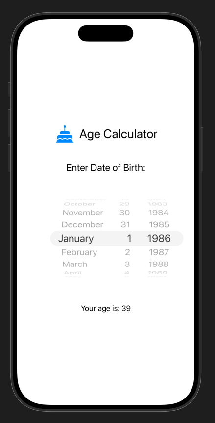
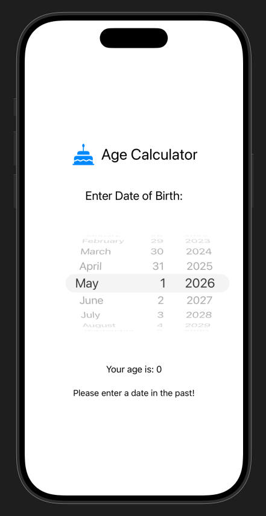

***

# 🎂 Age Calculator App

Welcome to my **Age Calculator**, a super-simple SwiftUI app built for iOS 17! If you need to know your age (or anyone else’s)—simply spin the date wheel and let the cake emoji do the rest! 🍰

## 🚀 Features

- **SwiftUI powered:** Built entirely with SwiftUI for a snappy, modern iOS experience.
- **Easy Date Picker:** Just pick your date of birth—no typing, no fuss! 🗓️
- **Instant Age Calculation:** Your age appears instantly, updated in real-time as you scroll.
- **Built-in Error Handling:** The app gently reminds you not to pick a date from the future. ⏳
- **Simple, Clean UI:** Minimal distractions, just smooth scrolling and a delicious birthday cake icon! 🎉


## 🛠️ How It Works

1. Launch the app.
2. Scroll and select your date of birth using the wheel picker.
3. See your calculated age instantly!
4. If you accidently select a future date, the app playfully prompts: _"Please enter a date in the past!"_

## 📚 Origin Story

This app was inspired by the Building Your First iOS 17 App course by Todd Perkins on LinkedIn Learning. Since I come from a place where tipping isn’t really a thing, the tip calculator example didn’t quite resonate with me as a learning project. On the other hand, I often find myself forgetting my exact age—usually just guessing somewhere in the right ballpark. So I decided to take that everyday little challenge of mine and make it the centerpiece of this app. It’s a way to build on the tutorial’s concepts but with a personal twist that reflects how I think and solve problems. This project shows how the ideas learned can be adapted and expanded to create something meaningful and uniquely mine. 🎯

## 📦 SwiftUI Code Example

The core logic lives in a few lines:

```swift
func calculateAge(secondsSinceDate:Double) -> Int{
    let years:Int = Int(floor(secondsSinceDate / 31556952))
    if years < 1{
        return 0
    }else{
        return years
    }
}
```


## 🧁 Screenshot

Want to see how sweet it looks? Here’s a quick preview:




## 🏗️ Build \& Run

1. Clone/download the repository.
2. Open in Xcode 15 or later.
3. Hit Build \& Run!
4. Start spinning—and start living!

## 💡 About

Designed as a learning project and a fun alternative to tip calculators. Great for birthdays, nostalgia trips, or just keeping track! Try it out and let every day be a reason to smile. 😄
